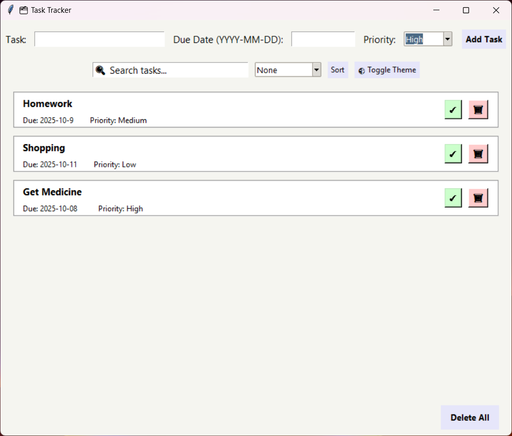

# Task Tracker / To-Do App

A Python GUI application to manage your tasks efficiently with a modern card-based interface.

---

## Features

- Add and delete tasks
- Mark tasks as complete
- Assign **due dates** and **priority levels**
- Search tasks with a live search bar
- Sort tasks by **due date** or **priority**
- Light/Dark theme toggle
- Modern card-based layout with color-coded tasks
- Delete all tasks with a single click
- Hover effects on buttons and cards

---

## Requirements

- Python 3.x
- `tkinter` (usually comes with Python)
- `json` (standard library for storing tasks)

---

## Setup

1. Clone this repository or download the project.
2. Navigate to the `task-tracker` folder.
3. Run the application:

---

### ✂️ Screenshot

---

### License

This project is open-source and available under the MIT License.