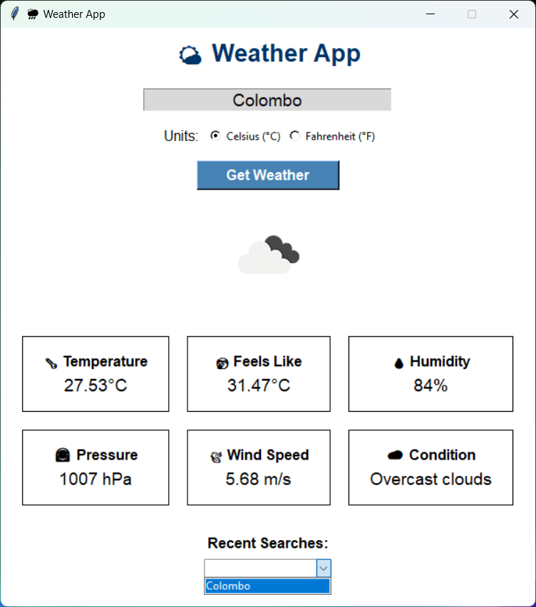

# 🌦 Weather App (Tkinter)

A simple weather app built with Python and Tkinter.  
It fetches real-time weather data using the OpenWeatherMap API.

## 🚀 Features
- Current temperature, feels like, humidity, wind, pressure
- Switch between °C and °F
- Weather icons
- Search history
- Clean UI with separate info boxes

<<<<<<< HEAD
## Setup
=======
## ⚙️ Setup
>>>>>>> 30c9d9a1ec766d85fba75f52fe5af82a3e9c87c9
1. Install dependencies:
   
   pip install -r requirements.txt

2. Get a free API key from OpenWeatherMap.

3. Replace "YOUR_API_KEY" in weather_app.py with your key.

4. Run:

    python weather_app.py

---

<<<<<<< HEAD
### Screenshots

=======
### ✂️ Screenshot

>>>>>>> 30c9d9a1ec766d85fba75f52fe5af82a3e9c87c9
